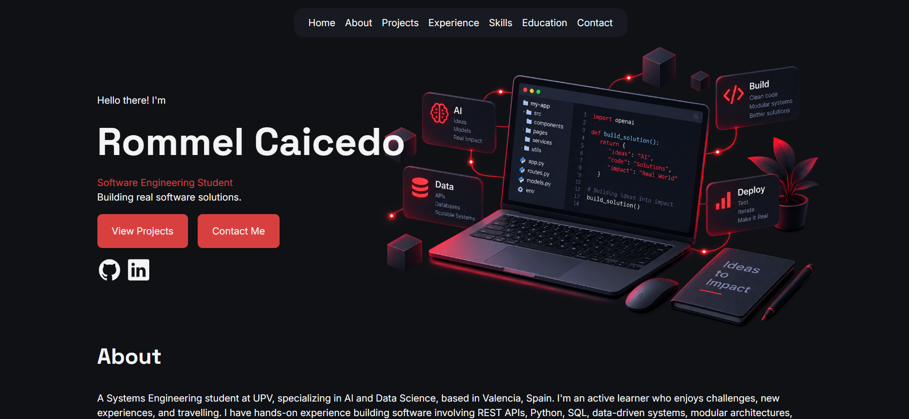
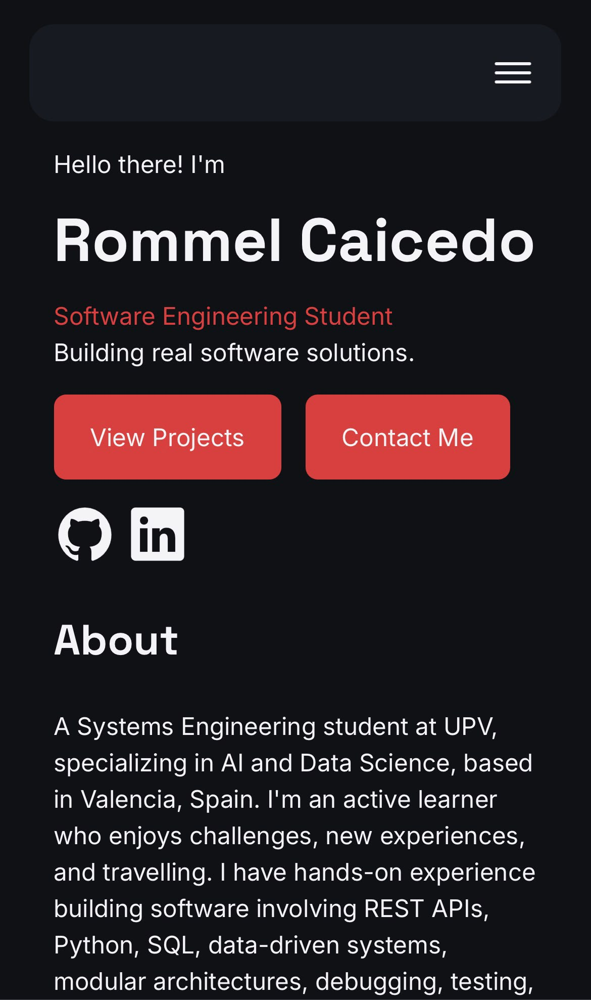

# Rommel Caicedo — Professional Portfolio

This project is my software engineering portfolio, built to present my projects, experience, technical skills, education, and growth as a developer. It also documents the development process behind the portfolio, from planning and structure to implementation and deployment, using a professional Git and GitHub workflow.

<p align="center">
    
    
</p>

## Live Demo

The portfolio is deployed with GitHub Pages.

[View the live portfolio](https://rcaicedo20.github.io/)

## About the Project

This portfolio was built using foundational HTML, CSS, and JavaScript knowledge. I completed the first version in about 12 days, spending much of that time learning and practicing HTML, CSS, Git, and GitHub while building the project.

Before writing the final implementation, I planned the portfolio structure, selected the main sections, defined the content for each one, and created documentation describing the intended behaviour and design. I also created a design system containing the main colours, typography, spacing, responsive behaviour, and interaction guidelines. Wireframes were generated with the help of ChatGPT to translate those ideas into a visual reference before implementation.

The project followed a Git and GitHub workflow based on real software development practices. Work was organized through GitHub Issues, dedicated branches, focused commits, pull requests, self-review, and merges into the main branch. I implemented the HTML structure and content first, followed by responsive CSS styling. JavaScript was later added to support the responsive burger navigation menu.

## Features

- Responsive mobile-first layout
- Dark visual theme
- Custom Inter and Space Grotesk fonts
- Floating responsive navigation bar
- Burger navigation menu below the desktop breakpoint
- Desktop navigation from 1024px and above
- Responsive layouts using Flexbox and CSS Grid
- Project, Experience, Education, Skills, and Contact sections
- Hover transitions and interactive visual states
- Visible keyboard focus states
- Reduced-motion support
- Responsive desktop, tablet, and mobile layouts
- GitHub, LinkedIn, email, and CV links

## Technologies Used

- HTML5
- CSS3
- JavaScript
- Git
- GitHub
- GitHub Pages

## Tools

- Visual Studio Code
- PowerShell
- Milanote — planning and organization
- ChatGPT — learning guidance, development feedback, and wireframe generation
- Palette Hunt — colour inspiration

## Project Structure

```text
rcaicedo20.github.io/
|   index.html
|   README.md
|
+---assets
|   +---documents
|   |       rommel_caicedo_cv.pdf
|   |
|   +---fonts
|   |   +---inter
|   |   |       Inter-Italic-VariableFont_opsz,wght.ttf
|   |   |       Inter-VariableFont_opsz,wght.ttf
|   |   |       OFL.txt
|   |   |
|   |   \---space-grotesk
|   |           OFL.txt
|   |           SpaceGrotesk-VariableFont_wght.ttf
|   |
|   \---images
|           hero-section-image.png
|           portfolio-desktop-preview.png
|           portfolio-mobile-preview.jpeg
|           rommel-profile-photo.png
|
+---css
|       styles.css
|
+---documentation
|   |   content.md
|   |   design-system.md
|   |   portfolio-planning.md
|   |
|   \---wireframes
|           desktop-interaction-stages.png
|           desktop-portfolio-wireframe.png
|           mobile-navigation-and-expanded-card-states.png
|           mobile-portfolio-wireframe.png
|
\---js
        main.js
```
## Running Locally

Clone the repository:

```text
git clone git@github.com:RCaicedo20/rcaicedo20.github.io.git
```
Move into a project directory: 
```text
cd yourdirectoryname
```
Since the portfolio is a static website, you can open ```text index.html ``` directly in your browser. Alternatively, you can run a local development server.

For example, using Python: 
```text
python -m http.server 8000
```
Then open:
```text
http://localhost:8000
```
## Project Status

### Portfolio V0 — Complete

V0 focuses on creating a functional, responsive, and visually consistent portfolio while applying the HTML, CSS, JavaScript, Git, and GitHub fundamentals learned during development.

The current version intentionally keeps some interactions simple while I continue developing my JavaScript and accessibility knowledge.

### Known Limitation

The desktop Experience section currently uses a hover-based interaction to reveal its summary. Because this interaction depends on pointer hover, it is not yet fully accessible to keyboard-only users.

This behaviour is planned to be redesigned in a future version using a proper accessible interaction.

### Future Improvements

Planned improvements for future versions include:

- Expandable Experience cards
- Expandable Education cards
- Keyboard-accessible interactive card behaviour
- Showing additional Experience information when a card is selected
- Dedicated case-study pages for individual projects
- Improved accessibility for interactive components
- Additional portfolio projects and content

## Author

### Rommel Caicedo

[GitHub](https://github.com/RCaicedo20)

[LinkedIn](https://www.linkedin.com/in/rommel-caicedo-espa%C3%B1a-362b1914b/)
